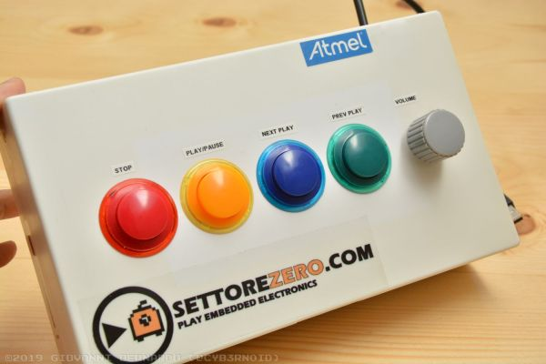

# MediaPlayerKeyboard  

  

A simple USB Keyboard for controlling media players using the Arduino Leonardo.  
I've used 4 cheap arcade pushbuttons for PLAY/PAUSE - STOP - Previous Song - Next Song and a chinese Rotary Encoder for System Volume control, but, hey, here's the source code so you can personalize it!  
Please: if you realize this project, send me some pictures so I'll include them in my blog linking your website or whatever you want!  

This project was featured on Hackaday [here](https://hackaday.com/2019/12/22/arcade-buttons-make-a-great-multimedia-keyboard/)

Here the link to original article [IT](https://www.settorezero.com/wordpress/una-tastiera-usb-con-controlli-per-i-media-players-con-arduino-leonardo/) [EN](https://www.settorezero.com/wordpress/en/una-tastiera-usb-con-controlli-per-i-media-players-con-arduino-leonardo/)
